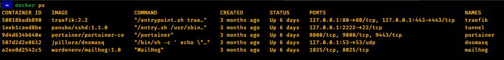

# Environment Setup

For this section, we will use the Warden CLI uility for orchestrating the Docker based developer environment. I will 
guide you through the setup Warden process, but feel free to read over the [Warden docs](https://docs.warden.dev/index.html)
if you want more info or just to familiarise yourself with the utility.

Warden is used because it supports multiple frameworks like M1, M2, Laravel, etc. It also helps maintain the same tech 
stack within your development team and closely mimics every service that would be used in a production environment.

Warden will build your project with the following containers:
- Nginx
- PHP FPM (with composer, n98, and all required PHP extensions)
- PHP FPM with xdebug
- Elastic Search
- Elastic Search HQ
- MYSQL
- RabbitMQ
- Redis


## Table of contents:

- [System requirements and setups](#system-requirements-and-setups)
- [Prerequisites](#prerequisites)
- [Magento environment setup](#magento-environment-setup)
- [Magento install](#magento-install)
- [Cleanup](#cleanup)
- [Notes](#notes)
- [Troubleshooting](#troubleshooting)

## System requirements and setups

| Package/Apps   | Version  |
|----------------|----------|
| Docker Desktop | 2.2.0.0+ |
| docker-compose | 1.25.0+  |
| Homebrew       | 3.4.0+   |

### Docker Desktop

1. Download and install from <https://www.docker.com/products/docker-desktop/>

2. Once installed, assign at least 6GB RAM (8GB recommended) to Docker Desktop in `Preferences -> Resources -> Advanced -> Memory`.

### Homebrew

Install and follow command prompts:
```bash
/bin/bash -c "$(curl -fsSL https://raw.githubusercontent.com/Homebrew/install/HEAD/install.sh)"
```

For additional info see <https://brew.sh/>
   
### docker-compose

Install and follow command prompts:
```bash
brew install docker-compose
```

### Warden

Install and follow command prompts:
```bash
brew install davidalger/warden/warden
warden svc up
```

You should now have a new container group called `warden` with several global services running. 
To confirm, run:
```bash
docker ps
```
Output


The following URL's can be used to interact with the UI's for services Warden runs globally:

- Traefik - <https://traefik.warden.test/> - Reverse proxy and load balancer.
- Portainer - <https://portainer.warden.test/> - Docker container management.
- Dnsmasq - <https://dnsmasq.warden.test/> - DNS management.
- MailHog - <https://mailhog.warden.test/> - Fake SMTP mail server for email testing. 


## Prerequisites

1. Create a personal access token (with read/write permissions) on GitLab, Github or BitBucket.
2. Create your access tokens on the Magento marketplace.
3. Copy this info as we will be using it in the next few steps.


## Magento environment setup

For this section, we will be using either an existing git repository or create a new one, for Magento 2. We will assume 
you have a general `sites` folder in your home directory, where it is home to all your individual projects.

### 1. Create temp global vars:

The global environment variables are only temporary and will be used for the duration of this setup.

```bash
export M2_VENDOR="mycompany"
export M2_PROJECT="m2-test"
export M2_GIT_REPO="git@github.com:shaughnlgh/m2-test.git"
export M2_DOMAIN="magento.test"

# custom ports
export M2_REDIS_PORT="6379"
export M2_DB_PORT="3306"
export M2_ES_PORT="9200"

# repo.magento.com auth details
export M2_MAGENT_REPO_USER="user"
export M2_MAGENT_REPO_PASS="pass"
```
*Update where necessary*

### 2. Prepare your Magento 2 project files:

[Create a new Magento 2 project](#2a-create-a-new-magento-2-project)
or
[Use an existing Magento 2 project](#2b-use-an-existing-magento-2-project)


#### 2.a. Create a new Magento 2 project:

__Create your project directories and initialize git:__

```bash
mkdir -p ~/sites/m2-test
cd ~/sites/m2-test
git init
```

__Create composer.json file:__

The following composer.json is valid for Magento 2.4.5 and can be updated if required. Some dependancies have been 
locked down to their individual package versions, since earlier/later versions seem to cause conflicting issues.
```bash
cat > composer.json << EOF
{
    "name": "${M2_VENDOR}/${M2_PROJECT}",
    "description": "Magento 2",
    "type": "project",
    "license": "proprietary",
    "config": {
        "preferred-install": "dist",
        "sort-packages": true,
        "allow-plugins": {
            "laminas/laminas-dependency-plugin": true,
            "dealerdirect/phpcodesniffer-composer-installer": true,
            "magento/*": true,
            "cweagans/composer-patches": true
        }
    },
    "version": "2.4.5",
    "require": {
        "magento/composer-dependency-version-audit-plugin": "~0.1",
        "magento/composer-root-update-plugin": "~2.0",
        "magento/product-community-edition": "2.4.5",
        "spomky-labs/aes-key-wrap": "^6.0",
        "symfony/deprecation-contracts": "v2.5.0",
        "symfony/property-info": "v5.4.2",
        "symfony/string": "v5.4.2"
    },
    "autoload": {
        "exclude-from-classmap": [
            "**/dev/**",
            "**/update/**",
            "**/Test/**"
        ],
        "files": [
            "app/etc/NonComposerComponentRegistration.php"
        ],
        "psr-0": {
            "": [
                "app/code/",
                "generated/code/"
            ]
        },
        "psr-4": {
            "Magento\\\": "app/code/Magento/",
            "Magento\\\Framework\\\": "lib/internal/Magento/Framework/",
            "Magento\\\Setup\\\": "setup/src/Magento/Setup/"
        }
    },
    "require-dev": {
        "allure-framework/allure-phpunit": "~1.5.0",
        "cweagans/composer-patches": "^1.7",
        "dealerdirect/phpcodesniffer-composer-installer": "^0.7.0",
        "friendsofphp/php-cs-fixer": "~3.3.0",
        "lusitanian/oauth": "~0.8.10",
        "magento/magento-coding-standard": "*",
        "magento/magento2-functional-testing-framework": "^3.7",
        "pdepend/pdepend": "~2.10.0",
        "phpmd/phpmd": "^2.9.1",
        "phpstan/phpstan": "^1.2.0",
        "phpunit/phpunit": "^9.5.0",
        "sebastian/phpcpd": "^6.0.3",
        "squizlabs/php_codesniffer": "~3.6.0",
        "symfony/finder": "^5.2",
        "symplify/vendor-patches": "^11.0"
    },
    "conflict": {
        "gene/bluefoot": "*"
    },
    "autoload-dev": {
        "psr-4": {
            "Magento\\\PhpStan\\\": "dev/tests/static/framework/Magento/PhpStan/",
            "Magento\\\Sniffs\\\": "dev/tests/static/framework/Magento/Sniffs/",
            "Magento\\\TestFramework\\\Inspection\\\": "dev/tests/static/framework/Magento/TestFramework/Inspection/",
            "Magento\\\TestFramework\\\Utility\\\": "dev/tests/static/framework/Magento/TestFramework/Utility/",
            "Magento\\\Tools\\\": "dev/tools/Magento/Tools/",
            "Magento\\\Tools\\\Sanity\\\": "dev/build/publication/sanity/Magento/Tools/Sanity/"
        }
    },
    "repositories": {
        "packagist-repo": {
            "type": "composer",
            "url": "https://repo.packagist.org"
        },
        "magento-repo": {
            "type": "composer",
            "url": "https://repo.magento.com/"
        }
    },
    "extra": {
        "magento-force": "override"
    },
    "scripts": {
        "post-install-cmd": [
            "([ \$COMPOSER_DEV_MODE -eq 0 ] || vendor/bin/phpcs --config-set installed_paths ../../magento/magento-coding-standard/)"
        ],
        "post-update-cmd": [
            "([ \$COMPOSER_DEV_MODE -eq 0 ] || vendor/bin/phpcs --config-set installed_paths ../../magento/magento-coding-standard/)"
        ]
    },
    "minimum-stability": "dev",
    "prefer-stable": true
}
EOF
```


### 2.b. Use an existing Magento 2 project:

__Create your project directories and clone repository:__

```bash
mkdir -p ~/sites/m2-test
cd ~/sites/m2-test
git clone ${M2_GIT_REPO} .
git checkout master
```


### 3. Create Warden env file:

```bash
cat > .env << EOF
WARDEN_ENV_NAME=${M2_PROJECT}
WARDEN_ENV_TYPE=magento2
WARDEN_WEB_ROOT=/

TRAEFIK_DOMAIN=${M2_DOMAIN}
TRAEFIK_SUBDOMAIN=m2

WARDEN_DB=1
WARDEN_ELASTICSEARCH=1
WARDEN_VARNISH=0
WARDEN_RABBITMQ=1
WARDEN_REDIS=1

ELASTICSEARCH_VERSION=7.16
MYSQL_DISTRIBUTION=mysql
MYSQL_VERSION=8.0
NODE_VERSION=10
COMPOSER_VERSION=2
PHP_VERSION=8.1
PHP_XDEBUG_3=1
RABBITMQ_VERSION=3.9
REDIS_VERSION=6.2
VARNISH_VERSION=7.0

WARDEN_SYNC_IGNORE=

WARDEN_ALLURE=0
WARDEN_SELENIUM=0
WARDEN_SELENIUM_DEBUG=0
WARDEN_BLACKFIRE=0
WARDEN_SPLIT_SALES=0
WARDEN_SPLIT_CHECKOUT=0
WARDEN_TEST_DB=0
WARDEN_MAGEPACK=0

BLACKFIRE_CLIENT_ID=
BLACKFIRE_CLIENT_TOKEN=
BLACKFIRE_SERVER_ID=
BLACKFIRE_SERVER_TOKEN=
EOF
```

This file can be set in your `.gitignore` if you like, but recommended that you create a `.env.template` for easier 
onboarding in the future.


### 4. Create self-signed certificate:

```bash
warden sign-certificate ${M2_DOMAIN}
```


### 5. Customize Warden:

For this section we need to pass the global gitconfig file to the container service in order to run composer
within the container, without issue. We also need to assign custom ports to some of the services. Finally, we need to 
setup crontab so that we can run Magento crons within the environment.

__Customize warden:__

```bash
mkdir .warden
cat > .warden/warden-env.yml << EOF
version: "3.9"
services:
  php-fpm:
    volumes:
      - .\${WARDEN_WEB_ROOT:-}/../.warden/crontab:/var/spool/cron/www-data
      - ~/.gitconfig:/home/www-data/.gitconfig
  php-debug:
    volumes:
      - ~/.gitconfig:/home/www-data/.gitconfig
  redis:
    ports:
      - ${M2_REDIS_PORT}:6379 # Exposed for node development
  db:
    command:
      - mysqld
      - --max_allowed_packet=1024M
      - --explicit_defaults_for_timestamp=on
      - --innodb-buffer-pool-size=2G
    image: \${WARDEN_IMAGE_REPOSITORY}/\${MYSQL_DISTRIBUTION}:\${MYSQL_VERSION:-8.0}
    ports:
      - ${M2_DB_PORT}:3306 # Exposed for node development
  elasticsearch:
    ports:
      - ${M2_ES_PORT}:9200
EOF
```

__Setup crontab:__

```bash
cat > .warden/crontab << EOF
#* * * * * /var/www/html/bin/magento cron:run 2>&1 | grep -v "Ran jobs by schedule" >> /var/www/html/var/log/cron.log
EOF
```


### 6. Add additional configs:

```bash
composer global config http-basic.repo.magento.com ${M2_MAGENT_REPO_USER} ${M2_MAGENT_REPO_PASS}
```
*Add additional configs here as you see fit.*


### 7. Start the project environment:

```bash
warden env up
```

The first time you run this, warden will compile and build your docker container with all the required Magento 2 
services.


## Magento Install

Now that we have the environment setup, we can proceed with the Magento installation.

First we need to access the container:

```bash
warden shell
```

This should log you into the php-fpm container, in the site root directory `/var/www/html`. The site root directory 
should contain all your Magento files (if you cloned an existing Magento repo) or you composer.json 
(if you created new). To check this, run:

```bash
ls -lah
```

Next, we will confirm both composer and n98-magerun are present:

```bash
composer -V
n98-magerun -V
```

This should ouput the version of each CLI utility. Once confirmed, we can then run composer install:

```bash
composer install
```

Next, we will attempt to install Magento (you can skip this if you already have a DB and `env.php` configured):

```bash
bin/magento setup:install \
  --db-host=db:3306 \
  --db-name=magento \
  --db-user=magento \
  --db-password=magento \
  --backend-frontname=admin \
  --amqp-host=rabbitmq \
  --amqp-port=5672 \
  --amqp-user=guest \
  --amqp-password=guest \
  --search-engine=elasticsearch7 \
  --elasticsearch-host=elasticsearch \
  --elasticsearch-port=9200 \
  --elasticsearch-index-prefix=magento2 \
  --elasticsearch-enable-auth=0 \
  --elasticsearch-timeout=15 \
  --cache-backend=redis \
  --cache-backend-redis-server=redis \
  --cache-backend-redis-db=0 \
  --cache-backend-redis-port=6379 \
  --session-save=redis \
  --session-save-redis-host=redis \
  --session-save-redis-port=6379 \
  --session-save-redis-log-level=3 \
  --session-save-redis-max-concurrency=30 \
  --session-save-redis-db=2 \
  --session-save-redis-disable-locking=1 \
  --page-cache=redis \
  --page-cache-redis-server=redis \
  --page-cache-redis-db=1 \
  --page-cache-redis-port=6379 \
  -n
```

Once that has completed successfully, you can use `bin\magento` or `n98-magerun` to create a new admin user or update
configs as you normally would.

If you have skipped the previous install step and you already have a DB and `env.php` configured, you will need to 
manually update your `env.php` with the same details as above.

To use your existing DB, you will need to copy the DB to your MySQL container. Open a **new terminal window** and run:

```bash
docker cp ~/path-to-sql-on-local-machine/magento.sql m2-test_db_1:/
docker exec -it m2-test_db_1 bash
mysql -umagento -pmagento magento < magento.sql
exit
```
*Please note that `m2-test_db_1` is the name of the container. To get the name of your container, just run 
`docker ps | grep mysql`*

Their will be project specific UI's that have been setup for you (assuming you used the `magento.test` domain):

- Magento - <https://m2.magento.test/>
- ElasticHQ - <https://elastichq.magento.test/>
- Elastic Search - <https://elasticsearch.magento.test/>
- RabbitMQ - <https://rabbitmq.magento.test/>

Thats it.


## Cleanup

To remove the global environment variables, either exit then terminal window, or run:
```bash
unset M2_VENDOR
unset M2_PROJECT
unset M2_GIT_REPO
unset M2_DOMAIN
unset M2_REDIS_PORT
unset M2_DB_PORT
unset M2_ES_PORT
unset M2_MAGENT_REPO_USER
unset M2_MAGENT_REPO_PASS
```


## Notes

To stop the project and halt all services related to it, run:

```bash
warden env down
```
*This will not remove any volume data, like the DB, logs, etc.*

To start the project, run:

```bash
warden env up
```

If you make any changes in the `.warden` folder, you will need to recreate the builds:

```bash
warden env up -d
```

To access the PHP-FPM container, run:

```bash
warden shell
```

To access the PHP-FPM container with XDEBUG, run:

```bash
warden debug
```
*This is super helpful when debugging crons or CLI related tasks in Magento.*


## Troubleshooting

### Some containers exit when running multiple projects

It is possible to run multiple projects at the same time, however I have found one or 2 small issues with this. To get 
around the issue, its best to just run `warden down` / `warden up` when switching between projects. You then also do 
not have to manage custom ports, etc.

### MySQL container exits with error

This would normally only happen during the initial setup. To get around this, remove the DB volume:

```bash
# Fetch the name of the volume
docker volume ls

# Remove the volume
docker volume rm m2-test_dbdata
```

Then run `warden env up -d` and check if the container has started successfully.
