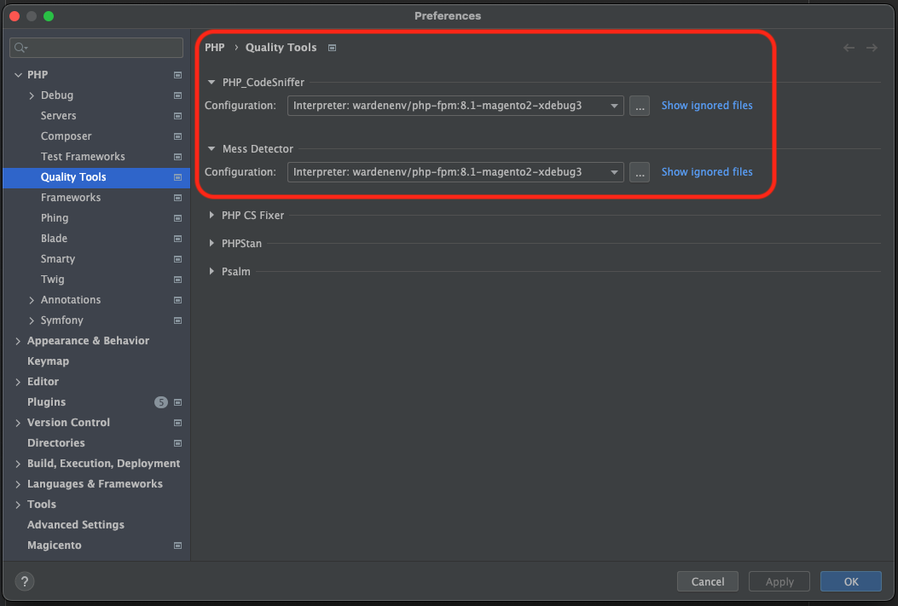

# PHPStorm configurations

Assuming you have followed the [Enviroment Setup](enviroment-setup.md) guide, you will need to configure PHPStorm for
your project. 

## Configure ESLint, PHPCS and PHPMD:

Please see <https://developer.adobe.com/commerce/testing/guide/static/analysis/> for ESLint, PHPCS and PHPMD
configurations. Follow all the steps set provided in that documentation.

## Update PHP config and CLI interpreters:

Go to `PHPStorm preferences > PHP` and click the `...` button (next to CLI interpreter) to bring up another
configuration modal.

This should bring up a CLI interpreters modal. In the top right of the modal, click the `+` to add a new CLI interpreter.

This should show a select, choose `Docker`.

This will bring up another modal titled `Configure Remote PHP interpreter`. Add the following:

| Field                         | Value                                  |
|-------------------------------|----------------------------------------|
| Server                        | Docker                                 |
| Image name                    | wardenenv/php-fpm:8.1-magento2-xdebug3 |
| PHP interpreter path          | php                                    |

Click `OK`. This will close the current modal and display the relevant interpreter info. You can choose a new name or leave default.

Click `Apply`, then `OK`. This will close the current modal and display the relevant PHP configurations.
Update the `PHP language level` to `8.1`, then click `Apply`.

## Add PHP Server:

Go to `PHPStorm preferences > PHP > Servers` and click the `+` button to add a new server.

This will add a new entry that must be updated to the following:

| Field             | Value          |
|-------------------|----------------|
| Name              | m2-test-docker |
| Shared            | No             |
| Host              | 127.0.0.1      |
| Port              | 80             |
| Debugger          | Xdebug         |
| Use path mappings | Yes            |

*Ensure the name matches the docker group container name, with the suffix `-docker`. If this is not set correctly, you 
will not be able to use Xdebug correctly.*

Set path mappings:

| Directory         | Absolute path on server |
|-------------------|-------------------------|
| Project directory | /var/www/html           |

Click `Apply`.

## Configure XDEBUG:

Go to `PHPStorm preferences > PHP > Debug`. In the Xdebug section, update the `Debug port` to `9001,9003`, then 
uncheck all checkboxes in the Xdebug section.

Click `Apply`.

## Configure Quality tools:

Go to `PHPStorm preferences > PHP > Quality Tools`. Configure both `PHP_CodeSniffer` and `Mess Detector` to use the PHP 
interpreter you setup previously.

For `PHP_CodeSniffer` click on the `...` button. This will bring up a `PHP_CodeSniffer` modal. Click the `+` button to 
add new configuration. This should show another modal titled `PHP_CodeSniffer By Remote Interpreter`. Select the 
interpreter you setup previously, then click `OK`.

This should then auto resolve and populate everything for you. All you will need to do is click the `Validate` button 
to confirm that it is working correctly, the click `Apply` only.

Click on the `PHP_CodeSniffer inspection` link located at the bottom of the modal. This will open an inspection modal 
which should show the `PHP_CodeSniffer validation`. Ensure that the options for `Show sniff name` is checked and 
`Installed standards path` is unchecked. __This is very important else the Magento2 codding standard will not show up.__
For now, leave the `Coding standard` as is. Click `OK` to close the `inspections` modal, then click `Apply` and `OK` in 
the `PHP_CodeSniffer` modal.

For `Mess Detector` click on the `...` button. This will bring up a `Mess Detector` modal. Click the `+` button to
add new configuration. This should show another modal titled `Mess Detector By Remote Interpreter`. Select the
interpreter you setup previously, then click `OK`.

This should then auto resolve and populate everything for you. All you will need to do is click the `Validate` button
to confirm that it is working correctly, then click `Apply` and `OK`.

Click `OK` to close the preferences window, then restart PHPStorm. When PHPStorm has restarted, open up the project 
again, then go to `PHPStorm preferences > PHP > Quality Tools`.

For `PHP_CodeSniffer` click on the `...` button. This will bring up a `PHP_CodeSniffer` modal that we previously 
updated. Click on the `PHP_CodeSniffer inspection` link located at the bottom of the modal. 

This should bring up another modal which links directly to the inspection. Ensure that the `Coding standard` is set to
`Magento2`.

Next, search for `PHP Mess Detector validation` in the same inspection window. Ensure it is enabled by checking the
checkbox and ensure all inspection options are selected. Then click the `+` button, under `Custom rulesets` and set 
the ruleset as `[magento_root]/dev/tests/static/testsuite/Magento/Test/Php/_files/phpmd/ruleset.xml`.

Next, search for `PHP CS Fixer validation` in the same inspection window. Ensure it is disabled by unchecking the
checkbox.

Click `OK` to close the inspection window. Click `Apply` and `OK` in the `PHP_CodeSniffer` modal.