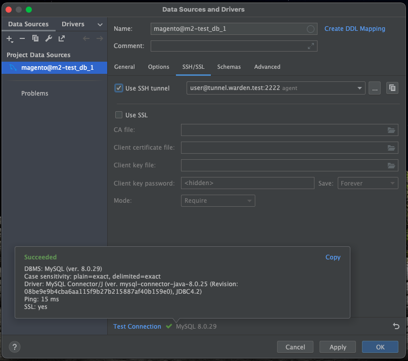

# PHPStorm configurations

Assuming you have followed the [Enviroment Setup](enviroment-setup.md) guide, you will need to configure PHPStorm for
your project.

If you have not followed the `Environment Setup` guide and have a barebones setup on your machine, then follow the 
instructions in <https://developer.adobe.com/commerce/testing/guide/static/analysis/> for ESLint, PHPCS and PHPMD
configurations.

## Table of contents:

- [Plugins](#plugins)
- [Update PHP config and CLI interpreters](#update-php-config-and-cli-interpreters)
- [Add PHP Server](#add-php-server)
- [Configure Xdebug](#configure-xdebug)
- [Configure Quality Tools](#configure-quality-tools)
  - [PHPCS Configuration](#phpcs-configuration)
  - [PHPMD Configuration](#phpmd-configuration)
- [Configure Composer](#configure-composer)
- [Configure Database](#configure-database)

## Plugins:

I recommend the following PHPStorm plugins.

- .env files support
- .ignore
- CamelCase
- GraphQL
- Ideolog
- Json Formatter
- Magento PhpStorm
- PHP Advanced AutoComplete
- PHP Annotation
- Rainbow CSV
- Magicento 2 (Not free)
- Symfony Support
- Php Inspections (EA Extended)

Also ensure you enable some of the bundled plugins like:

- Database Tools and SQL
- Docker

Please feel free to add to this list.

## Update PHP config and CLI interpreters:

Go to `PHPStorm preferences > PHP` and click the `...` button, on the right of the CLI interpreter select:

This should bring up a CLI interpreters modal. In the top right of the modal, click the `+` to add a new CLI 
interpreter:

This should show a select, choose `Docker`:

Another modal titled `Configure Remote PHP interpreter`. Add the following:

| Field                         | Value                                  |
|-------------------------------|----------------------------------------|
| Server                        | Docker                                 |
| Image name                    | wardenenv/php-fpm:8.1-magento2-xdebug3 |
| PHP interpreter path          | php                                    |
*The image name may vary depending on the image used.*

Click `OK`. This will close the current modal and display the relevant interpreter info. You can choose a different, 
meaningful name or leave as default:

Click `Apply`, then `OK`. This will close the current modal and display the relevant PHP configurations.
Update the `PHP language level` to `8.1`, then click `Apply`:

## Add PHP Server:

Go to `PHPStorm preferences > PHP > Servers` and click the `+` button to add a new server:

This will add a new entry that must be updated to the following:

| Field             | Value          |
|-------------------|----------------|
| Name              | m2-test-docker |
| Shared            | No             |
| Host              | 127.0.0.1      |
| Port              | 80             |
| Debugger          | Xdebug         |
| Use path mappings | Yes            |

*Ensure the name matches the docker group container name, with the suffix `-docker`. If this is not set correctly, you 
will not be able to use Xdebug.*

Set path mappings:

| Directory         | Absolute path on server |
|-------------------|-------------------------|
| Project directory | /var/www/html           |

Click `Apply`.

## Configure Xdebug:

Go to `PHPStorm preferences > PHP > Debug`. 

In the `Xdebug` section, update the `Debug port` to `9001,9003` and uncheck all checkboxes, except 
`Can accept external connections`.

Scroll down to the `Advanced settings` section and uncheck `Notify if debug session was finished without being paused`.

Click the `Apply` button.

## Configure Quality Tools:

Go to `PHPStorm preferences > PHP > Quality Tools`. 

Configure both `PHP_CodeSniffer` and `Mess Detector` to use the PHP interpreter you setup previously:

### PHPCS configuration:

Go to `PHPStorm preferences > PHP > Quality Tools`.

Select `PHP_CodeSniffer` and click the `...` button, on the right of the `Configuration` dropdown:

This will bring up a `PHP_CodeSniffer` modal. Click the `+` button to add new configuration:

This will bring up another modal titled `PHP_CodeSniffer By Remote Interpreter`.

Select the interpreter you setup previously, then click `OK`:

This should then auto-resolve and populate everything for you. All you will need to do is click the `Validate` button 
to confirm that it is working correctly, the click `Apply` **only**:

Click on the `PHP_CodeSniffer inspection` link:

This will open an inspection modal which should show the `PHP_CodeSniffer validation`.

Ensure that the `PHP_CodeSniffer validation` is checked and that the options for `Show sniff name` is checked and 
`Installed standards path` is unchecked. 
__This is very important and will allow for the Magento2 coding standard to show up.__

Leave the `Coding standard` as is because we will need to restart PHPStorm in order for the setting to be applied.

Click `OK` to close the `inspections` modal, then click `Apply` and `OK` on the `PHP_CodeSniffer` modal.

Click `Apply` and `OK` to exit preferences, and then restart PHPStorm.

When PHPStorm has restarted, open up your project and go to `PHPStorm preferences > PHP > Quality Tools`.

Select `PHP_CodeSniffer` and click the `...` button, on the right of the `Configuration` dropdown:

Click on the `PHP_CodeSniffer inspection` link:

This will open an inspection modal which should show the `PHP_CodeSniffer validation`.

Ensure that the `Coding standard` is set to `Magento2`:

Click `OK` to close the `inspections` modal, then click `Apply` and `OK` on the `PHP_CodeSniffer` modal.

### PHPMD configuration:

Go to `PHPStorm preferences > PHP > Quality Tools`.

Select `Mess Detector` and click the `...` button, on the right of the `Configuration` dropdown:

This will bring up a `Mess Detector` modal. Click the `+` button to add new configuration:

This will bring up another modal titled `Mess Detector By Remote Interpreter`.

Select the interpreter you setup previously, then click `OK`:

This should then auto-resolve and populate everything for you. All you will need to do is click the `Validate` button
to confirm that it is working correctly, the click `Apply` **only**:

Click on the `PHP Mess Detector inspection` link:

This will open an inspection modal which should show the `PHP Mess Detector validation`.

Ensure that the `PHP Mess Detector validation` is checked and all `Options` for the validation is checked.

Then click the `+` button, under `Custom rulesets` and set the ruleset as 
`[magento_root]/dev/tests/static/testsuite/Magento/Test/Php/_files/phpmd/ruleset.xml`.

Click `OK` to close the `inspections` modal, then click `Apply` and `OK` on the `Mess Detector` modal.

Click `Apply` and `OK` to exit preferences.

## Configure Composer:

Go to `PHPStorm preferences > PHP > Composer`.

In the `Execution` section, select `Remote Interpreter`. Select the interpreter you setup previously, then click 
`Apply` and `OK`:

## Configure Database:

In your project, click on the `Database` tab located in your bottom or right toolbar:

This will show a `Database` window. Click the `+` button to add a new database configuration:

Select `Data Source` -> `MySQL` from the dropdowns:

A `Data Sources and Drivers` modal will be displayed. There should be a default localhost Data Source already displayed.
If not, click on the `+` button to add one.

In the `General` tab, update the following:

| Field          | Value           |
|----------------|-----------------|
| Host           | m2-test_db_1    |
| Port           | 3306            |
| Authentication | User & Password |
| User           | magento         |
| Password       | magento         |
| Database       | magento         |
*The host will be the name of the MySQL docker container*

In the `SSH/SSL` tab, check `Use SSH tunnel` and click on the `...` button:

An `SSH Configurations` modal will open. Click on the `+` button to add a new configuration and update the following:

| Field               | Value                                   |
|---------------------|-----------------------------------------|
| Host                | tunnel.warden.test                      |
| Port                | 2222                                    |
| Username            | user                                    |
| Authentication type | OpenSSH config and authentication agent |

Click on the `Test Connection` button. This should result in a successful connection:

Click `Apply` and `OK`. The `SSH Configurations` modal will close and update the `SSH Tunnel` dropdown:

Click on the `Test Connection` button. This should result in a successful connection:

Click `Apply` and `OK`.

The Database should now load up and you will be able to perform queries directly in PHPStorm:

